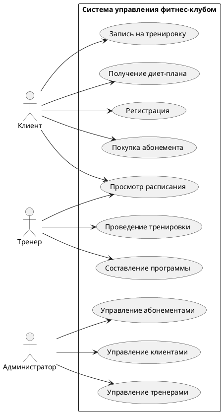
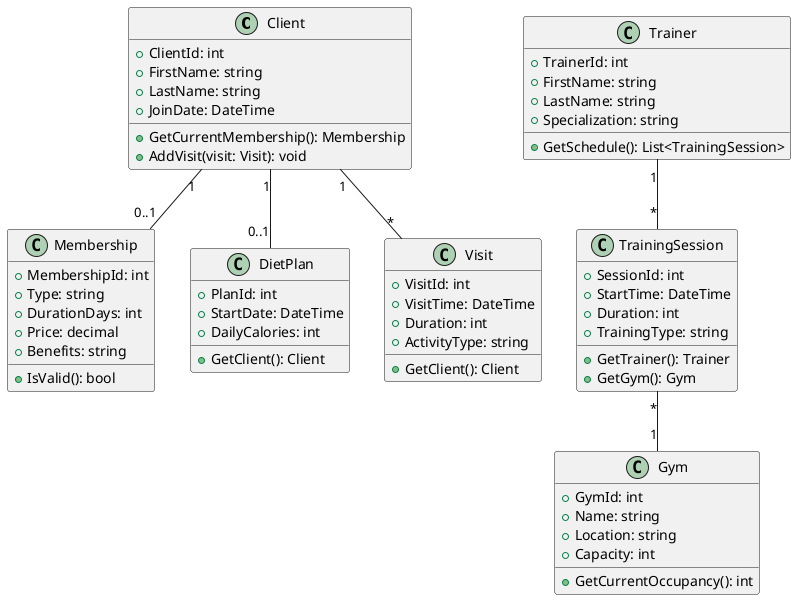
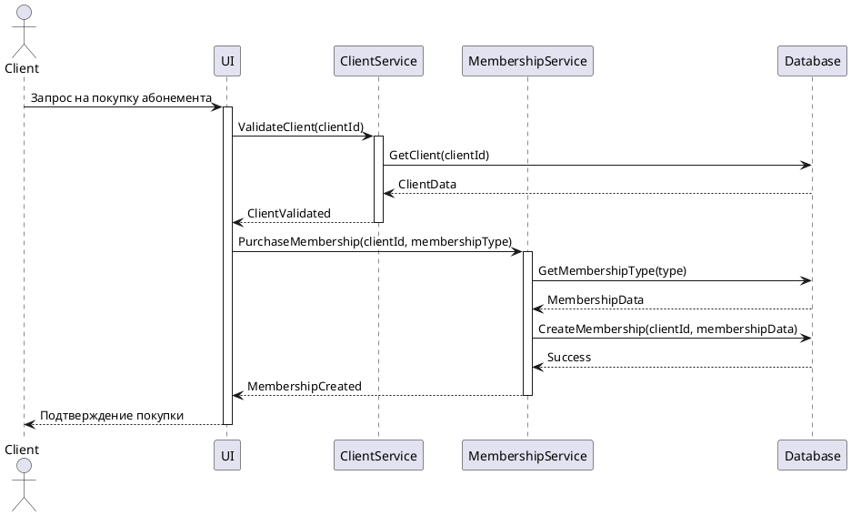

# Система управления фитнес-клубом

## Описание проблемы
Система управления фитнес-клубом предназначена для автоматизации основных бизнес-процессов фитнес-клуба, включая управление клиентами, тренерами, абонементами, тренировками и посещениями. Система решает следующие проблемы:
- Учет клиентов и их абонементов
- Планирование тренировок и распределение нагрузки на тренеров
- Контроль посещаемости и использования услуг
- Управление диетическими планами клиентов
- Мониторинг загруженности залов

## Ключевые функции
1. Управление клиентами:
   - Регистрация новых клиентов
   - Продление абонементов
   - Отслеживание посещений
   - Назначение персональных тренировок

2. Управление тренерами:
   - Учет специализации и квалификации
   - Составление расписания работы
   - Назначение на тренировки

3. Управление абонементами:
   - Различные типы абонементов
   - Учет срока действия
   - Контроль оплаты

4. Управление тренировками:
   - Планирование групповых занятий
   - Запись на персональные тренировки
   - Контроль загруженности залов

5. Управление диетическими планами:
   - Создание индивидуальных планов питания
   - Отслеживание прогресса

## UML-диаграммы

### 1. Диаграмма вариантов использования (Use Case Diagram)

### 2. Диаграмма классов (Class Diagram)

### 3. Диаграмма последовательностей (Sequence Diagram)

## Обоснование выбора диаграмм

1. **Диаграмма вариантов использования** выбрана для наглядного представления всех возможных действий пользователей системы. Она помогает понять, какие функции должны быть реализованы для каждой роли пользователя.

2. **Диаграмма классов** показывает структуру системы, включая все основные сущности, их атрибуты и методы, а также связи между ними. Это ключевая диаграмма для понимания архитектуры приложения и его дальнейшей реализации.

3. **Диаграмма последовательностей** демонстрирует взаимодействие между компонентами системы на примере типичного сценария использования - покупки абонемента. Она помогает понять, как различные слои приложения взаимодействуют друг с другом.

## Архитектурные решения

1. **Трехслойная архитектура**:
   - Слой представления (UI)
   - Бизнес-слой (Services)
   - Слой данных (Repositories)

2. **Паттерны проектирования**:
   - Repository Pattern для работы с базой данных
   - Service Pattern для бизнес-логики
   - Factory Pattern для создания объектов

3. **Принципы SOLID**:
   - Single Responsibility Principle: каждый класс отвечает за одну конкретную функциональность
   - Open/Closed Principle: возможность расширения функционала без изменения существующего кода
   - Interface Segregation: использование специализированных интерфейсов
   - Dependency Inversion: зависимость от абстракций, а не от конкретных реализаций 